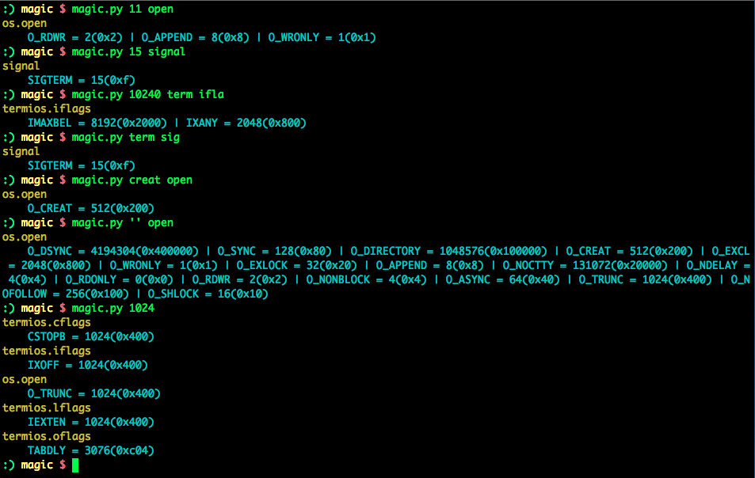

# Magic

When you are [gnireenigne](http://en.wikipedia.org/wiki/Reverse_engineering) some binary file, have you ever wondered, WTF are those magic numbers?

When you are browsing source code of a giant project, have you ever complained, what are the value of those magic constants?

Here you are, [magic](https://github.com/zTrix/magic) Solves these issues for you.

# Usage

    $ magic.py (number|name) [keyword | [keyword] ...]

examples here:

    $ magic.py 11 open
    $ magic.py 15 signal
    $ magic.py 10240 term iflags
    $ magic.py term signal
    $ magic.py creat open

    # list all consts in open
    $ magic.py '' open

    # list all consts value of 3
    $ magic.py 1024

# Screenshot

# installation

 - python2
 - termcolor (optional, for color output support) `$ pip install termcolor`

# Call for PULL Request!

The framework is basically finished, but we need to fill with a lot of magic numbers to make [magic](https://github.com/zTrix/magic) really useful. Please contribute your magic.
